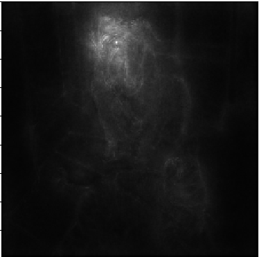
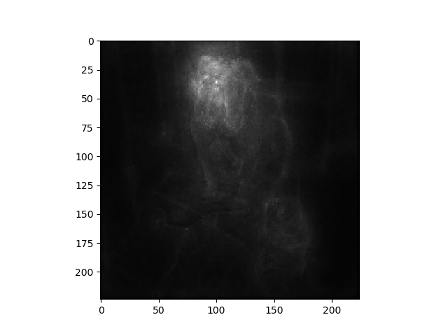

# chainer-smoothgrad

chainerでSmoothGradを実装
ガウシアンノイズ付きの入力の出力に対する勾配を計算することで注視領域を計算している。
ハイパーパラメータとしてはn, σの2つある。

## 結果

||Grad-CAM|SmoothGrad(n=100,σ=0.2)|
|:-:|:-:|:-:|:-:|
|Boxer (242)|||
|Tiger Cat (282)|||

## 必要ライブラリ

- Chainer
- OpenCV

## 元論文

- [1] Daniel Smilkov, Nikhil Thorat, Been Kim, Fernanda Virgas, Martin Wattenberg,
"SmoothGrad: removing noise by adding noise",
https://arxiv.org/pdf/1706.03825.pdf